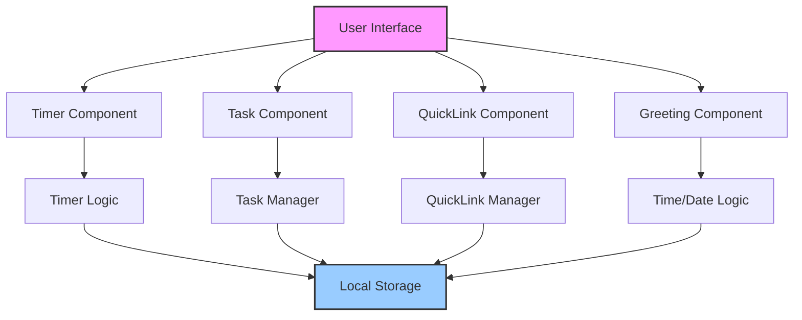

# Design Document: Todo-Life-Dashboard

## Overview

The Todo-Life-Dashboard is a browser-based time management application that combines a Pomodoro-style focus timer, task tracking, and quick links management into a single, cohesive interface. The application is built using HTML, CSS, and vanilla JavaScript with all functionality contained in a single HTML file, a single CSS file, and a single JavaScript file. Data persistence is achieved through the browser's Local Storage API.

The application addresses four core functional areas:
1. **Greeting System**: Displays current date/time with dynamic greetings based on time of day
2. **Focus Timer**: 25-minute countdown timer following the Pomodoro technique
3. **To-Do List**: Complete task management with add, edit, complete, and delete operations
4. **Quick Links**: Bookmark management with add, edit, delete, and open-in-new-tab functionality

## Architecture

### High-Level Component Diagram



### Component Structure

```
todo-life-dashboard/
├── index.html              # Single HTML file - main application entry point
├── css/
│   └── style.css          # Single CSS file - all styling
└── js/
    └── app.js             # Single JavaScript file - all logic
```

### Data Flow

1. **Initialization Phase**: On page load, the application reads from Local Storage to populate tasks and quick links
2. **Timer Phase**: The timer runs independently, updating the display every second and persisting state
3. **Task Phase**: Users can create, read, update, and delete tasks with immediate Local Storage synchronization
4. **Quick Link Phase**: Users can manage bookmarks with full CRUD operations and Local Storage persistence

## Components and Interfaces

### Greeting Component

**Purpose**: Display current date/time with dynamic greeting

**Interface**:
```javascript
// Update greeting based on current time
updateGreeting()
// Returns: void

// Format date for display
formatDate(date: Date): string
// Returns: "Monday, January 1, 2024"

// Format time for display
formatTime(date: Date): string
// Returns: "14:30:45"

// Get greeting string based on hour
getGreeting(hour: number): string
// Returns: "Good Morning" | "Good Afternoon" | "Good Evening" | "Good Night"
```

**Data Models**:
- No persistent data model - purely derived from current time

**State**:
- Current timestamp (updated every second)

**User Interface**:
```
┌─────────────────────────────────────┐
│  Good Morning, Welcome!             │
│  Monday, January 1, 2024            │
│  09:30:45                           │
└─────────────────────────────────────┘
```

---

### Focus Timer Component

**Purpose**: 25-minute Pomodoro-style countdown timer

**Interface**:
```javascript
// Start the timer
startTimer(): void

// Stop/pause the timer
stopTimer(): void

// Reset timer to 25 minutes
resetTimer(): void

// Get remaining time in seconds
getRemainingTime(): number

// Get timer status
getStatus(): 'Running' | 'Stopped' | 'Completed'

// Calculate progress percentage
getProgressPercentage(): number
// Returns: 0-100
```

**Data Models**:
```javascript
{
  totalTime: number,      // 25 minutes = 1500 seconds (constant)
  remainingTime: number,  // Current remaining time in seconds
  status: 'Running' | 'Stopped' | 'Completed'
}
```

**State**:
- `totalTime`: 1500 seconds (fixed)
- `remainingTime`: Current countdown value
- `status`: Timer state (Running/Stopped/Completed)
- `intervalId`: Reference to setInterval for cleanup

**User Interface**:
```
┌─────────────────────────────────────┐
│  Focus Timer                        │
├─────────────────────────────────────┤
│  25:00                              │
│  [████████████░░░░░░░░░░░] 42%    │
│  Status: Running                    │
├─────────────────────────────────────┤
│  [Start] [Stop] [Reset]             │
└─────────────────────────────────────┘
```

**Functionality**:
- Default: 25 minutes (1500 seconds)
- Update frequency: Every second
- Progress bar: Visual representation of elapsed time
- Status indicator: Shows current timer state
- Auto-completion: Stops and indicates when reaching 00:00

---

### Task Component

**Purpose**: Full task management with CRUD operations

**Interface**:
```javascript
// Add a new task
addTask(title: string): void

// Edit an existing task
editTask(id: string, newTitle: string): void

// Toggle task completion status
toggleTask(id: string): void

// Delete a task
deleteTask(id: string): void

// Get all tasks
getTasks(): Array<Task>

// Save tasks to Local Storage
saveTasks(): void

// Load tasks from Local Storage
loadTasks(): void
```

**Data Models**:
```javascript
{
  id: string,             // Unique identifier (UUID format)
  title: string,          // Task description
  completed: boolean,     // Completion status
  createdAt: number       // Timestamp of creation
}
```

**State**:
- `tasks`: Array of task objects

**User Interface**:
```
┌─────────────────────────────────────┐
│  To-Do List                         │
├─────────────────────────────────────┤
│  [________________Add Task_______]  │
│  [Add]                              │
├─────────────────────────────────────┤
│  [✓] Complete task    [Edit] [Del]  │
│  [ ] Pending task     [Edit] [Del]  │
│  [ ] Another task     [Edit] [Del]  │
└─────────────────────────────────────┘
```

**Functionality**:
- Add: Creates task with unique ID, default incomplete status, timestamp
- Edit: Modify task title in place
- Complete: Toggle between completed/incomplete states
- Delete: Remove task from list and storage
- Persistence: Immediate Local Storage sync on all operations

---

### Quick Link Component

**Purpose**: Bookmark management with open-in-new-tab capability

**Interface**:
```javascript
// Add a new quick link
addQuickLink(name: string, url: string): void

// Edit an existing quick link
editQuickLink(id: string, newName: string, newUrl: string): void

// Delete a quick link
deleteQuickLink(id: string): void

// Open quick link in new tab
openLink(id: string): void

// Get all quick links
getQuickLinks(): Array<QuickLink>

// Save quick links to Local Storage
saveQuickLinks(): void

// Load quick links from Local Storage
loadQuickLinks(): void
```

**Data Models**:
```javascript
{
  id: string,             // Unique identifier (UUID format)
  name: string,           // Display name
  url: string             // Web address
}
```

**State**:
- `quickLinks`: Array of quick link objects

**User Interface**:
```
┌─────────────────────────────────────┐
│  Quick Links                        │
├─────────────────────────────────────┤
│  [Name: __________] [URL: ______]   │
│  [Add]                              │
├─────────────────────────────────────┤
│  [GitHub]      [https://github.com] │
│  [Stack Overflow] [stackoverflow.com]│
│  [MDN Docs]    [developer.mozilla.org]│
└─────────────────────────────────────┘
```

**Functionality**:
- Add: Creates quick link with unique ID
- Edit: Modify name and URL
- Delete: Remove from list and storage
- Open: Launch URL in new tab with `target="_blank"`
- Persistence: Immediate Local Storage sync on all operations

---

### Local Storage Manager

**Purpose**: Centralized data persistence layer

**Interface**:
```javascript
// Save data to Local Storage
save(key: string, data: any): void

// Load data from Local Storage
load(key: string): any

// Check if key exists
hasKey(key: string): boolean

// Remove key from storage
remove(key: string): void
```

**Storage Keys**:
- `todoTasks`: Stores task array
- `todoQuickLinks`: Stores quick link array

**Error Handling**:
- Catch and log Local Storage exceptions
- Fallback to in-memory storage if Local Storage unavailable
- Graceful degradation if storage is full

---

## Data Models

### Task Model
```javascript
{
  id: "uuid-v4",
  title: "Task description",
  completed: false,
  createdAt: 1704100000000
}
```

**Validation Rules**:
- `id`: Must be unique string (UUID format)
- `title`: Non-empty string (after trimming)
- `completed`: Boolean
- `createdAt`: Valid timestamp (number)

### Quick Link Model
```javascript
{
  id: "uuid-v4",
  name: "Link name",
  url: "https://example.com"
}
```

**Validation Rules**:
- `id`: Must be unique string (UUID format)
- `name`: Non-empty string (after trimming)
- `url`: Valid URL format (basic validation)

### Timer State Model
```javascript
{
  totalTime: 1500,
  remainingTime: 1500,
  status: "Stopped"
}
```

---

## Correctness Properties

*A property is a characteristic or behavior that should hold true across all valid executions of a system—essentially, a formal statement about what the system should do. Properties serve as the bridge between human-readable specifications and machine-verifiable correctness guarantees.*

### Property 1: Timer countdown preserves total time

*For any* timer instance, the sum of elapsed time and remaining time should always equal the total time (1500 seconds)

**Validates: Requirements 3.2**

### Property 2: Timer completion stops the countdown

*For any* timer that reaches 00:00, the timer should stop and status should be "Completed"

**Validates: Requirements 3.7**

### Property 3: Timer reset restores initial state

*For any* timer, after resetting, the remaining time should equal the total time (1500 seconds) and status should be "Stopped"

**Validates: Requirements 3.5**

### Property 4: Progress percentage calculation accuracy

*For any* timer value, the progress percentage should equal `(totalTime - remainingTime) / totalTime * 100`

**Validates: Requirements 3.8**

### Property 5: Greeting matches time-of-day classification

*For any* valid hour (0-23), the greeting function should return the correct greeting based on the defined time ranges:
- 05:00-11:59 → "Good Morning"
- 12:00-17:59 → "Good Afternoon"  
- 18:00-21:59 → "Good Evening"
- 22:00-04:59 → "Good Night"

**Validates: Requirements 2.1, 2.2, 2.3, 2.4**

### Property 6: Task add increases list length by one

*For any* task list and valid task title, adding the task should increase the list length by exactly one

**Validates: Requirements 4.1, 4.3**

### Property 7: Task persistence round-trip

*For any* task, adding it to the list and then loading from Local Storage should return an equivalent task

**Validates: Requirements 4.2, 13.1, 13.3**

### Property 8: Task edit preserves all fields except title

*For any* task, editing the title should preserve the ID, completion status, and creation timestamp

**Validates: Requirements 5.1, 5.2**

### Property 9: Task completion toggle is idempotent inverse

*For any* task, toggling completion twice should return the task to its original completion state

**Validates: Requirements 6.1**

### Property 10: Task deletion removes only the specified task

*For any* task list with multiple tasks, deleting one task should remove only that task and leave all others intact

**Validates: Requirements 7.1, 7.3**

### Property 11: Quick link add increases list length by one

*For any* quick link list and valid name/URL pair, adding the quick link should increase the list length by exactly one

**Validates: Requirements 8.1, 8.3**

### Property 12: Quick link persistence round-trip

*For any* quick link, adding it to the list and then loading from Local Storage should return an equivalent quick link

**Validates: Requirements 8.2, 13.2, 13.4**

### Property 13: Quick link edit preserves ID and validates inputs

*For any* quick link, editing name and URL should preserve the ID and validate that both fields are non-empty

**Validates: Requirements 9.1, 9.2**

### Property 14: Quick link deletion removes only the specified link

*For any* quick link list with multiple links, deleting one link should remove only that link and leave all others intact

**Validates: Requirements 10.1, 10.3**

## Error Handling

### Local Storage Errors
- Catch `QuotaExceededError` when storage is full
- Log errors to console for debugging
- Display user-friendly error message if critical data cannot be saved
- Attempt to continue with in-memory storage as fallback

### Input Validation Errors
- Task title: Reject empty or whitespace-only titles
- Quick link name: Reject empty or whitespace-only names
- Quick link URL: Basic format validation (must contain domain)
- Invalid inputs should be rejected with visual feedback

### Timer State Errors
- Prevent starting an already running timer
- Prevent stopping an already stopped timer
- Handle edge cases where timer interval might not clean up properly

### Browser Compatibility Errors
- Check for Local Storage availability before use
- Gracefully handle missing features in older browsers
- Log warnings for unsupported functionality

---

## Testing Strategy

### Dual Testing Approach

This application uses a combination of example-based unit tests and property-based tests for comprehensive coverage.

### Property-Based Testing

Property-based tests will be implemented using **fast-check** (for JavaScript/Node.js environments) or **Test.Check** (for ClojureScript environments). Each property test will:
- Run a minimum of 100 iterations per property
- Include the feature name and property reference in test tags
- Cover all universally quantified correctness properties

**Property Tests (14 properties total)**:
1. Timer countdown time preservation
2. Timer completion stops countdown
3. Timer reset restores initial state
4. Progress percentage calculation accuracy
5. Greeting matches time-of-day classification
6. Task add increases list length by one
7. Task persistence round-trip
8. Task edit preserves other fields
9. Task completion toggle is idempotent inverse
10. Task deletion removes only specified task
11. Quick link add increases list length by one
12. Quick link persistence round-trip
13. Quick link edit preserves ID and validates inputs
14. Quick link deletion removes only specified link

### Unit Tests

Unit tests will cover:
- Specific edge cases not covered by properties
- UI interaction flows (click, input events)
- Integration points between components
- Error handling scenarios
- Local Storage exception handling

**Test Categories**:
- Timer edge cases (starting from different values, rapid start/stop)
- Task list management (ordering, filtering, edge sizes)
- Quick link management (URL format validation, special characters)
- Persistence edge cases (empty storage, corrupted data)

### Integration Tests

Integration tests will verify:
- End-to-end user workflows
- Cross-component interactions
- Local Storage data integrity across sessions
- Browser compatibility (Chrome, Firefox, Edge, Safari)

### Manual Testing

Manual testing should cover:
- Visual appearance and layout
- Responsive design on different screen sizes
- Accessibility (keyboard navigation, screen readers)
- Performance under heavy load

### Test Configuration

```javascript
// Example property test structure
{
  name: "Property 6: Task add increases list length",
  feature: "todo-life-dashboard",
  propertyNumber: 6,
  iterations: 100,
  test: (gc) => {
    // Generate random task list and title
    // Add task
    // Verify length increased by 1
  }
}
```

---

## Pseudocode and Function Signatures

### Timer Module
```javascript
// Initialize timer
function initTimer() {
  const timer = {
    totalTime: 1500,
    remainingTime: 1500,
    status: 'Stopped',
    intervalId: null
  };
  
  return timer;
}

// Start timer
function startTimer(timer) {
  if (timer.status === 'Running') return;
  
  timer.status = 'Running';
  timer.intervalId = setInterval(() => {
    timer.remainingTime--;
    
    if (timer.remainingTime <= 0) {
      timer.remainingTime = 0;
      stopTimer(timer);
    }
  }, 1000);
}

// Stop timer
function stopTimer(timer) {
  clearInterval(timer.intervalId);
  timer.status = 'Completed';
  timer.intervalId = null;
}

// Reset timer
function resetTimer(timer) {
  stopTimer(timer);
  timer.remainingTime = timer.totalTime;
  timer.status = 'Stopped';
}

// Get progress percentage
function getProgress(timer) {
  return ((timer.totalTime - timer.remainingTime) / timer.totalTime) * 100;
}
```

### Task Module
```javascript
// Add task
function addTask(tasks, title) {
  const task = {
    id: generateUUID(),
    title: title.trim(),
    completed: false,
    createdAt: Date.now()
  };
  
  return [...tasks, task];
}

// Edit task
function editTask(tasks, id, newTitle) {
  return tasks.map(task => {
    if (task.id === id) {
      return { ...task, title: newTitle.trim() };
    }
    return task;
  });
}

// Toggle task completion
function toggleTask(tasks, id) {
  return tasks.map(task => {
    if (task.id === id) {
      return { ...task, completed: !task.completed };
    }
    return task;
  });
}

// Delete task
function deleteTask(tasks, id) {
  return tasks.filter(task => task.id !== id);
}
```

### Quick Link Module
```javascript
// Add quick link
function addQuickLink(links, name, url) {
  const link = {
    id: generateUUID(),
    name: name.trim(),
    url: url.trim()
  };
  
  return [...links, link];
}

// Edit quick link
function editQuickLink(links, id, newName, newUrl) {
  return links.map(link => {
    if (link.id === id) {
      return { 
        ...link, 
        name: newName.trim(),
        url: newUrl.trim()
      };
    }
    return link;
  });
}

// Delete quick link
function deleteQuickLink(links, id) {
  return links.filter(link => link.id !== id);
}

// Open link in new tab
function openLink(url) {
  window.open(url, '_blank', 'noopener,noreferrer');
}
```

### Greeting Module
```javascript
// Get greeting based on hour
function getGreeting(hour) {
  if (hour >= 5 && hour <= 11) return 'Good Morning';
  if (hour >= 12 && hour <= 17) return 'Good Afternoon';
  if (hour >= 18 && hour <= 21) return 'Good Evening';
  return 'Good Night';
}

// Format date
function formatDate(date) {
  return date.toLocaleDateString('en-US', {
    weekday: 'long',
    year: 'numeric',
    month: 'long',
    day: 'numeric'
  });
}

// Format time
function formatTime(date) {
  return date.toLocaleTimeString('en-US', {
    hour12: false,
    hour: '2-digit',
    minute: '2-digit',
    second: '2-digit'
  });
}
```

### Local Storage Module
```javascript
// Save to Local Storage
function saveToLocalStorage(key, data) {
  try {
    localStorage.setItem(key, JSON.stringify(data));
  } catch (error) {
    console.error(`Failed to save ${key}:`, error);
    // Fallback to in-memory storage
  }
}

// Load from Local Storage
function loadFromLocalStorage(key) {
  try {
    const data = localStorage.getItem(key);
    return data ? JSON.parse(data) : [];
  } catch (error) {
    console.error(`Failed to load ${key}:`, error);
    return [];
  }
}
```

### Main Application Entry Point
```javascript
document.addEventListener('DOMContentLoaded', () => {
  // Initialize timer
  const timer = initTimer();
  
  // Load data from Local Storage
  const tasks = loadFromLocalStorage('todoTasks') || [];
  const quickLinks = loadFromLocalStorage('todoQuickLinks') || [];
  
  // Render initial UI
  renderGreeting();
  renderTimer(timer);
  renderTasks(tasks);
  renderQuickLinks(quickLinks);
  
  // Start timer update loop
  setInterval(() => {
    renderTimer(timer);
  }, 1000);
});
```

## File Structure

### index.html
```html
<!DOCTYPE html>
<html lang="en">
<head>
  <meta charset="UTF-8">
  <meta name="viewport" content="width=device-width, initial-scale=1.0">
  <title>Todo-Life-Dashboard</title>
  <link rel="stylesheet" href="css/style.css">
</head>
<body>
  <header>
    <h1>Todo-Life-Dashboard</h1>
    <div id="greeting"></div>
    <div id="clock"></div>
  </header>
  
  <main>
    <section id="timer-section">
      <h2>Focus Timer</h2>
      <div id="timer-display">25:00</div>
      <div id="progress-container">
        <div id="progress-bar"></div>
      </div>
      <p id="timer-status">Status: Stopped</p>
      <div id="timer-controls">
        <button id="start-btn">Start</button>
        <button id="stop-btn">Stop</button>
        <button id="reset-btn">Reset</button>
      </div>
    </section>
    
    <section id="task-section">
      <h2>To-Do List</h2>
      <div id="task-input-container">
        <input type="text" id="task-input" placeholder="Add a new task...">
        <button id="add-task-btn">Add</button>
      </div>
      <ul id="task-list"></ul>
    </section>
    
    <section id="quick-link-section">
      <h2>Quick Links</h2>
      <div id="quick-link-input-container">
        <input type="text" id="link-name-input" placeholder="Name">
        <input type="url" id="link-url-input" placeholder="URL">
        <button id="add-link-btn">Add</button>
      </div>
      <ul id="quick-link-list"></ul>
    </section>
  </main>
  
  <script src="js/app.js"></script>
</body>
</html>
```

### css/style.css
```css
/* Base styles */
:root {
  --primary-color: #4a90d9;
  --success-color: #4caf50;
  --danger-color: #f44336;
  --text-color: #333;
  --background-color: #f5f5f5;
  --card-background: #fff;
}

* {
  box-sizing: border-box;
  margin: 0;
  padding: 0;
}

body {
  font-family: -apple-system, BlinkMacSystemFont, 'Segoe UI', Roboto, sans-serif;
  background-color: var(--background-color);
  color: var(--text-color);
  line-height: 1.6;
}

/* Header */
header {
  background-color: var(--card-background);
  padding: 2rem;
  text-align: center;
  box-shadow: 0 2px 4px rgba(0,0,0,0.1);
}

h1 {
  font-size: 2rem;
  color: var(--primary-color);
  margin-bottom: 0.5rem;
}

#clock {
  font-size: 1.5rem;
  color: #666;
}

/* Main layout */
main {
  max-width: 800px;
  margin: 0 auto;
  padding: 2rem;
}

/* Sections */
section {
  background-color: var(--card-background);
  border-radius: 8px;
  padding: 1.5rem;
  margin-bottom: 1.5rem;
  box-shadow: 0 2px 4px rgba(0,0,0,0.1);
}

section h2 {
  font-size: 1.25rem;
  margin-bottom: 1rem;
  color: var(--primary-color);
}

/* Timer */
#timer-display {
  font-size: 3rem;
  font-weight: bold;
  text-align: center;
  margin: 1rem 0;
}

#progress-container {
  width: 100%;
  height: 10px;
  background-color: #e0e0e0;
  border-radius: 5px;
  overflow: hidden;
  margin: 1rem 0;
}

#progress-bar {
  height: 100%;
  background-color: var(--primary-color);
  width: 0%;
  transition: width 0.3s ease;
}

#timer-controls {
  display: flex;
  justify-content: center;
  gap: 0.5rem;
}

button {
  padding: 0.5rem 1rem;
  border: none;
  border-radius: 4px;
  cursor: pointer;
  font-size: 1rem;
  transition: background-color 0.2s;
}

button:hover {
  opacity: 0.9;
}

#start-btn { background-color: var(--success-color); color: white; }
#stop-btn { background-color: #ff9800; color: white; }
#reset-btn { background-color: var(--danger-color); color: white; }

/* Task list */
#task-input-container {
  display: flex;
  gap: 0.5rem;
  margin-bottom: 1rem;
}

#task-input {
  flex: 1;
  padding: 0.5rem;
  border: 1px solid #ddd;
  border-radius: 4px;
  font-size: 1rem;
}

#task-list {
  list-style: none;
}

.task-item {
  display: flex;
  align-items: center;
  padding: 0.75rem;
  background-color: #f9f9f9;
  border-radius: 4px;
  margin-bottom: 0.5rem;
}

.task-item.completed {
  text-decoration: line-through;
  opacity: 0.7;
}

.task-item .task-title {
  flex: 1;
  margin-right: 0.5rem;
}

.task-actions {
  display: flex;
  gap: 0.25rem;
}

/* Quick links */
#quick-link-input-container {
  display: flex;
  flex-direction: column;
  gap: 0.5rem;
  margin-bottom: 1rem;
}

#quick-link-list {
  list-style: none;
}

.quick-link-item {
  display: flex;
  justify-content: space-between;
  align-items: center;
  padding: 0.75rem;
  background-color: #f9f9f9;
  border-radius: 4px;
  margin-bottom: 0.5rem;
}

.quick-link-item a {
  color: var(--primary-color);
  text-decoration: none;
}

.quick-link-item a:hover {
  text-decoration: underline;
}

.link-actions {
  display: flex;
  gap: 0.25rem;
}
```

### js/app.js
```javascript
// Application state
let timer = initTimer();
let tasks = [];
let quickLinks = [];

// DOM elements
const elements = {
  greeting: document.getElementById('greeting'),
  clock: document.getElementById('clock'),
  timerDisplay: document.getElementById('timer-display'),
  progressBar: document.getElementById('progress-bar'),
  timerStatus: document.getElementById('timer-status'),
  startBtn: document.getElementById('start-btn'),
  stopBtn: document.getElementById('stop-btn'),
  resetBtn: document.getElementById('reset-btn'),
  taskInput: document.getElementById('task-input'),
  addTaskBtn: document.getElementById('add-task-btn'),
  taskList: document.getElementById('task-list'),
  linkNameInput: document.getElementById('link-name-input'),
  linkUrlInput: document.getElementById('link-url-input'),
  addLinkBtn: document.getElementById('add-link-btn'),
  quickLinkList: document.getElementById('quick-link-list')
};

// Initialize application
function init() {
  // Load data from Local Storage
  tasks = loadFromLocalStorage('todoTasks') || [];
  quickLinks = loadFromLocalStorage('todoQuickLinks') || [];
  
  // Render initial UI
  updateGreeting();
  renderTimer(timer);
  renderTasks(tasks);
  renderQuickLinks(quickLinks);
  
  // Start clock update
  setInterval(updateClock, 1000);
  
  // Event listeners
  elements.startBtn.addEventListener('click', () => startTimer(timer));
  elements.stopBtn.addEventListener('click', () => stopTimer(timer));
  elements.resetBtn.addEventListener('click', () => resetTimer(timer));
  elements.addTaskBtn.addEventListener('click', addTaskFromInput);
  elements.addLinkBtn.addEventListener('click', addQuickLinkFromInput);
  elements.taskInput.addEventListener('keypress', (e) => {
    if (e.key === 'Enter') addTaskFromInput();
  });
}

// Greeting functions
function updateGreeting() {
  const now = new Date();
  const hour = now.getHours();
  const greeting = getGreeting(hour);
  const date = formatDate(now);
  const time = formatTime(now);
  
  elements.greeting.textContent = `${greeting}, Welcome!`;
  elements.clock.textContent = `${date} - ${time}`;
}

function updateClock() {
  const now = new Date();
  elements.clock.textContent = `${formatDate(now)} - ${formatTime(now)}`;
}

function getGreeting(hour) {
  if (hour >= 5 && hour <= 11) return 'Good Morning';
  if (hour >= 12 && hour <= 17) return 'Good Afternoon';
  if (hour >= 18 && hour <= 21) return 'Good Evening';
  return 'Good Night';
}

function formatDate(date) {
  return date.toLocaleDateString('en-US', {
    weekday: 'long',
    year: 'numeric',
    month: 'long',
    day: 'numeric'
  });
}

function formatTime(date) {
  return date.toLocaleTimeString('en-US', {
    hour12: false,
    hour: '2-digit',
    minute: '2-digit',
    second: '2-digit'
  });
}

// Timer functions
function initTimer() {
  return {
    totalTime: 1500,
    remainingTime: 1500,
    status: 'Stopped',
    intervalId: null
  };
}

function startTimer(timer) {
  if (timer.status === 'Running') return;
  
  timer.status = 'Running';
  timer.intervalId = setInterval(() => {
    timer.remainingTime--;
    renderTimer(timer);
    
    if (timer.remainingTime <= 0) {
      timer.remainingTime = 0;
      stopTimer(timer);
    }
  }, 1000);
}

function stopTimer(timer) {
  clearInterval(timer.intervalId);
  timer.status = 'Completed';
  timer.intervalId = null;
  renderTimer(timer);
}

function resetTimer(timer) {
  stopTimer(timer);
  timer.remainingTime = timer.totalTime;
  timer.status = 'Stopped';
  renderTimer(timer);
}

function renderTimer(timer) {
  const minutes = Math.floor(timer.remainingTime / 60);
  const seconds = timer.remainingTime % 60;
  elements.timerDisplay.textContent = `${minutes.toString().padStart(2, '0')}:${seconds.toString().padStart(2, '0')}`;
  
  const progress = getProgress(timer);
  elements.progressBar.style.width = `${progress}%`;
  
  elements.timerStatus.textContent = `Status: ${timer.status}`;
}

function getProgress(timer) {
  return ((timer.totalTime - timer.remainingTime) / timer.totalTime) * 100;
}

// Task functions
function addTaskFromInput() {
  const title = elements.taskInput.value.trim();
  if (!title) {
    alert('Please enter a task title');
    return;
  }
  
  tasks = addTask(tasks, title);
  elements.taskInput.value = '';
  saveTasks();
  renderTasks(tasks);
}

function addTask(tasks, title) {
  const task = {
    id: generateUUID(),
    title: title,
    completed: false,
    createdAt: Date.now()
  };
  
  return [...tasks, task];
}

function editTask(id, newTitle) {
  tasks = editTask(tasks, id, newTitle);
  saveTasks();
  renderTasks(tasks);
}

function editTask(tasks, id, newTitle) {
  return tasks.map(task => {
    if (task.id === id) {
      return { ...task, title: newTitle };
    }
    return task;
  });
}

function toggleTask(id) {
  tasks = toggleTask(tasks, id);
  saveTasks();
  renderTasks(tasks);
}

function toggleTask(tasks, id) {
  return tasks.map(task => {
    if (task.id === id) {
      return { ...task, completed: !task.completed };
    }
    return task;
  });
}

function deleteTask(id) {
  tasks = deleteTask(tasks, id);
  saveTasks();
  renderTasks(tasks);
}

function deleteTask(tasks, id) {
  return tasks.filter(task => task.id !== id);
}

function saveTasks() {
  saveToLocalStorage('todoTasks', tasks);
}

function renderTasks(tasks) {
  elements.taskList.innerHTML = tasks.map(task => `
    <li class="task-item ${task.completed ? 'completed' : ''}">
      <span class="task-title">${escapeHtml(task.title)}</span>
      <div class="task-actions">
        <button onclick="toggleTask('${task.id}')">
          ${task.completed ? 'Undo' : 'Complete'}
        </button>
        <button onclick="editTask('${task.id}', prompt('Edit task:', '${escapeHtml(task.title)}'))">
          Edit
        </button>
        <button onclick="deleteTask('${task.id}')" style="background-color: var(--danger-color); color: white;">
          Delete
        </button>
      </div>
    </li>
  `).join('');
}

// Quick link functions
function addQuickLinkFromInput() {
  const name = elements.linkNameInput.value.trim();
  const url = elements.linkUrlInput.value.trim();
  
  if (!name) {
    alert('Please enter a link name');
    return;
  }
  
  if (!url) {
    alert('Please enter a URL');
    return;
  }
  
  quickLinks = addQuickLink(quickLinks, name, url);
  elements.linkNameInput.value = '';
  elements.linkUrlInput.value = '';
  saveQuickLinks();
  renderQuickLinks(quickLinks);
}

function addQuickLink(links, name, url) {
  const link = {
    id: generateUUID(),
    name: name,
    url: url
  };
  
  return [...links, link];
}

function editQuickLink(id, newName, newUrl) {
  quickLinks = editQuickLink(quickLinks, id, newName, newUrl);
  saveQuickLinks();
  renderQuickLinks(quickLinks);
}

function editQuickLink(links, id, newName, newUrl) {
  return links.map(link => {
    if (link.id === id) {
      return { 
        ...link, 
        name: newName,
        url: newUrl
      };
    }
    return link;
  });
}

function deleteQuickLink(id) {
  quickLinks = deleteQuickLink(quickLinks, id);
  saveQuickLinks();
  renderQuickLinks(quickLinks);
}

function deleteQuickLink(links, id) {
  return links.filter(link => link.id !== id);
}

function openLink(id) {
  const link = quickLinks.find(l => l.id === id);
  if (link) {
    window.open(link.url, '_blank', 'noopener,noreferrer');
  }
}

function saveQuickLinks() {
  saveToLocalStorage('todoQuickLinks', quickLinks);
}

function renderQuickLinks(quickLinks) {
  elements.quickLinkList.innerHTML = quickLinks.map(link => `
    <li class="quick-link-item">
      <a href="${escapeHtml(link.url)}" target="_blank" rel="noopener noreferrer">
        ${escapeHtml(link.name)}
      </a>
      <div class="link-actions">
        <button onclick="editQuickLink('${link.id}', prompt('Edit name:', '${escapeHtml(link.name)}'), prompt('Edit URL:', '${escapeHtml(link.url)}'))">
          Edit
        </button>
        <button onclick="deleteQuickLink('${link.id}')" style="background-color: var(--danger-color); color: white;">
          Delete
        </button>
        <button onclick="openLink('${link.id}')" style="background-color: var(--primary-color); color: white;">
          Open
        </button>
      </div>
    </li>
  `).join('');
}

// Utility functions
function generateUUID() {
  return 'xxxxxxxx-xxxx-4xxx-yxxx-xxxxxxxxxxxx'.replace(/[xy]/g, c => {
    const r = Math.random() * 16 | 0;
    const v = c === 'x' ? r : (r & 0x3 | 0x8);
    return v.toString(16);
  });
}

function saveToLocalStorage(key, data) {
  try {
    localStorage.setItem(key, JSON.stringify(data));
  } catch (error) {
    console.error(`Failed to save ${key}:`, error);
  }
}

function loadFromLocalStorage(key) {
  try {
    const data = localStorage.getItem(key);
    return data ? JSON.parse(data) : [];
  } catch (error) {
    console.error(`Failed to load ${key}:`, error);
    return [];
  }
}

function escapeHtml(text) {
  const div = document.createElement('div');
  div.textContent = text;
  return div.innerHTML;
}

// Start application
document.addEventListener('DOMContentLoaded', init);
```

## Implementation Notes

1. **UUID Generation**: Use a simple UUID v4 implementation for generating unique IDs
2. **Local Storage**: Wrap all Local Storage operations in try-catch blocks for error handling
3. **Input Validation**: Validate all user inputs before processing and saving
4. **Security**: Use `noopener,noreferrer` when opening links in new tabs for security
5. **Accessibility**: Ensure keyboard navigation works for all interactive elements
6. **Responsive Design**: Use relative units and flexible layouts for different screen sizes
7. **State Management**: Keep all state in memory and sync with Local Storage
8. **Error Handling**: Provide user-friendly error messages for common failure scenarios

---

## Review Checklist

- [x] Architecture designed with clear component separation
- [x] Data models defined for tasks and quick links
- [x] Timer implementation approach documented
- [x] Local Storage interaction patterns specified
- [x] Correctness properties identified (14 properties for PBT)
- [x] Error handling strategies outlined
- [x] Testing strategy defined (unit + property-based tests)
- [x] Complete pseudocode and function signatures provided
- [x] File structure and organization documented

---

*This design document is ready for implementation. The application follows the requirements-first approach with comprehensive property-based testing guidance.*